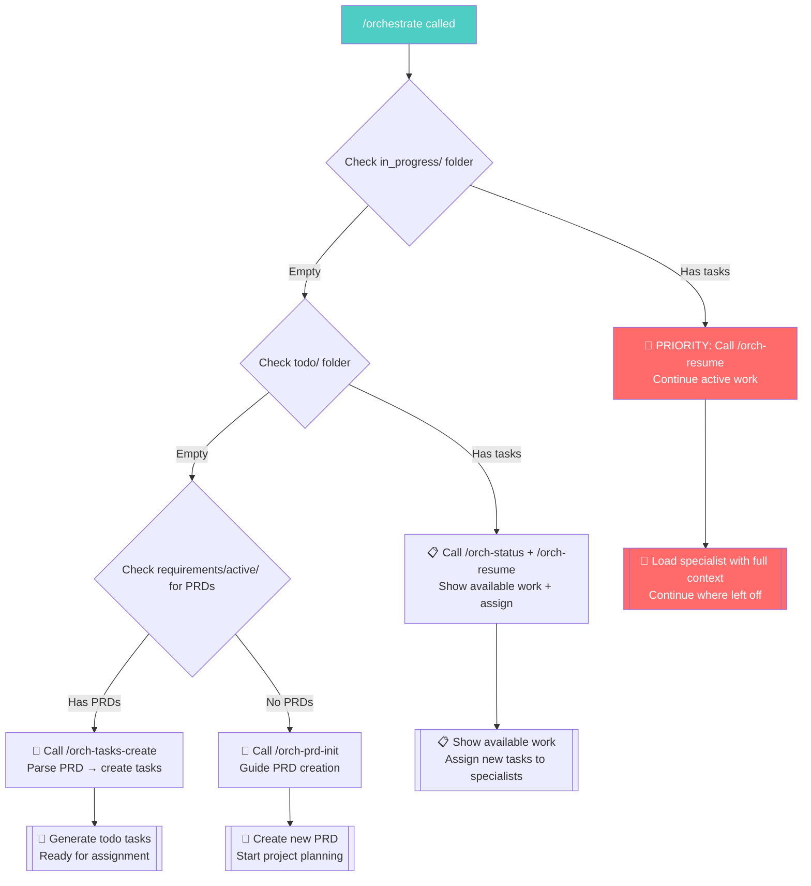
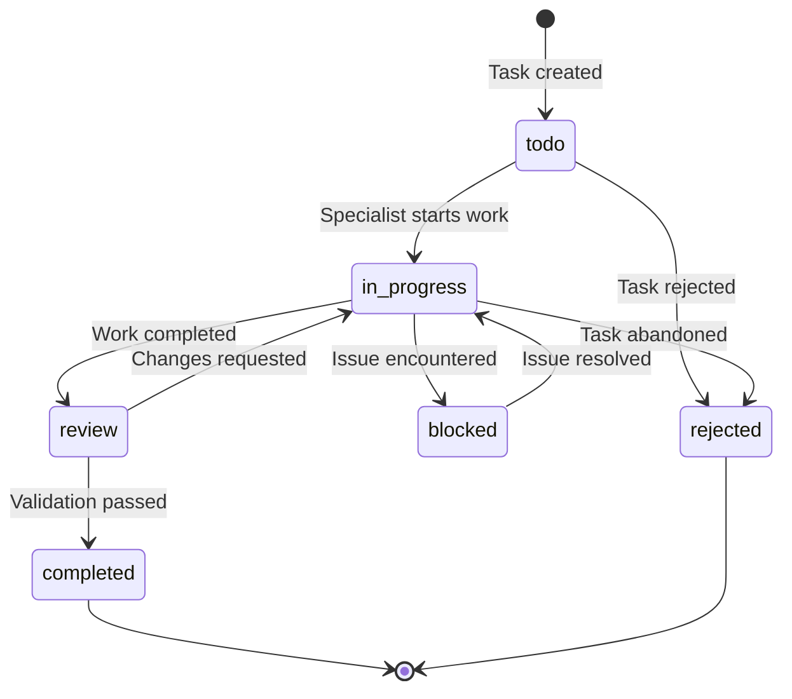

# /orchestrate - Smart Orchestration Command

## Purpose
Intelligent state detection and action command that adapts based on current project state.

## Behavior Logic - Auto Command Delegation

**Priority Order**: in_progress → todo → PRD creation → initialization

## Task State Flow

## Auto-Delegation Map
**State Detection → Command Routing (Priority Order):**
1. **In-Progress Tasks exist** → `/orch-resume` (IMMEDIATE)
2. **Todo Tasks exist (no in-progress)** → `/orch-status` then `/orch-resume`
3. **PRD exists, No Tasks** → `/orch-tasks-create` 
4. **No PRD, No Tasks** → `/orch-prd-init`
5. **Force modes** → Direct command calls

## Implementation
1. **Minimal Context Load**: Only check directory existence, not file contents
2. **Smart Routing**: Delegate heavy lifting to specialized commands
3. **State Detection (Priority Order)**: 
   - **FIRST**: Check `/.orchestrator/tasks/in_progress/` for active work (immediate priority)
   - **SECOND**: Check `/.orchestrator/tasks/todo/` for available work
   - **THIRD**: Check `/.orchestrator/requirements/active/` for PRDs to create tasks
   - Route to appropriate command based on highest priority state found
4. **Full Auto**: Enable completely autonomous operation through command chaining