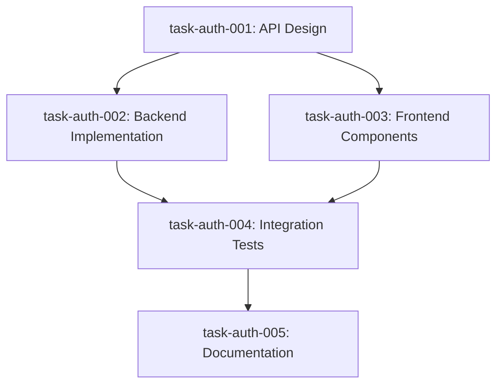

# Create Tasks from PRD
# Usage: /tasks-create <prd-id>

Break down a PRD into actionable tasks with proper sizing and dependencies:

## 1. Load and Parse PRD

```bash
# Load PRD file
prd_file="/requirements/active/${1}.prd.md"
if [ ! -f "$prd_file" ]; then
    echo "❌ PRD not found: ${1}"
    echo "Available PRDs:"
    ls /requirements/active/*.prd.md
    exit 1
fi
```

Parse machine-readable configuration from PRD:
- Required agents
- Priority level  
- Estimated scope
- Dependencies

## 2. Task Breakdown Strategy

### 2.1 Analyze Complexity
Based on PRD scope, determine breakdown approach:

```yaml
breakdown_rules:
  small_scope:  # 1-2 sprints
    - 3-5 tasks total
    - Group related requirements
    - Single agent per task preferred
    
  medium_scope: # 2-4 sprints
    - 5-15 tasks total
    - One task per major component
    - Consider parallel execution
    
  large_scope:  # 4+ sprints
    - Create epic structure
    - 15-30 tasks with phases
    - Clear milestone boundaries
```

### 2.2 Task Sizing Guidelines

Each task should follow these constraints:

```yaml
optimal_task_size:
  duration: 1-3 days
  acceptance_criteria: 3-7 items
  single_agent: true
  independently_testable: true
  
avoid_creating_tasks_that:
  - Take less than 2 hours
  - Have unclear completion
  - Require multiple agents sequentially  
  - Cannot be tested alone
```

## 3. Generate Task Breakdown

### 3.1 Standard Pattern
For a typical feature, create:

1. **Design/Planning Tasks** (if needed)
   - API design document
   - Database schema design
   - UI/UX mockups

2. **Implementation Tasks**
   - Backend API endpoints (one task per resource)
   - Frontend components (one task per major component)
   - Integration layers

3. **Testing Tasks**
   - Unit test suites
   - Integration tests
   - E2E test scenarios

4. **Documentation Tasks**
   - API documentation
   - User guides
   - Technical documentation

### 3.2 Task Creation Example

For each identified task:

```json
{
  "id": "task-${prd_id}-001",
  "prd_id": "${1}",
  "prd_version": "1.0",
  "metadata": {
    "title": "Implement user authentication API",
    "type": "implementation",
    "status": "draft",
    "priority": "high",
    "complexity": "medium",
    "estimated_hours": 16
  },
  "assignment": {
    "assigned_to": "backend",
    "assigned_at": null
  },
  "relationships": {
    "blocks": ["task-${prd_id}-002", "task-${prd_id}-005"],
    "blocked_by": []
  },
  "requirements": {
    "acceptance_criteria": [
      "POST /api/auth/login endpoint accepts email/password",
      "Returns JWT token on success",
      "Returns 401 on invalid credentials",
      "Rate limiting implemented (5 attempts/minute)"
    ]
  }
}
```

## 4. Establish Dependencies

Create dependency graph:



## 5. Update Registry

Update the task registry with new tasks:

```json
{
  "summary": {
    "total": "+5",
    "by_status": {
      "draft": "+5"
    },
    "by_agent": {
      "backend": "+2",
      "frontend": "+2",
      "qa": "+1"
    }
  },
  "active_tasks": {
    "task-auth-001": {
      "title": "API Design",
      "status": "draft",
      "assigned_to": "backend"
    }
    // ... other tasks
  }
}
```

## 6. Task File Creation

For each task:
1. Create JSON file in `/tasks/active/`
2. Include full task details
3. Initialize work_log with creation entry
4. Set initial status to "draft"

## 7. Output Summary

```
✅ Task Creation Complete
═══════════════════════════════════════════

Created 5 tasks for: auth-system

Breakdown by Agent:
- Backend: 2 tasks
- Frontend: 2 tasks  
- QA: 1 task

Dependency Chain:
1. task-auth-001: API Design (no dependencies)
2. task-auth-002: Backend Implementation (depends on 001)
3. task-auth-003: Frontend Components (depends on 001)
4. task-auth-004: Integration Tests (depends on 002, 003)
5. task-auth-005: Documentation (depends on 004)

Next Steps:
1. Review tasks: /status auth-system
2. Begin work: /orchestrate-start auth-system
3. Assign specific task: /task-assign task-auth-001
```

## 8. Smart Adjustments

If task count seems wrong:
- Too many (>30): Consider creating epics
- Too few (<3): Might be combining too much
- Suggest: "This created N tasks. Does this seem right for the scope?"

---
*Tasks created from PRD. Use `/orchestrate-start` to begin work.*
