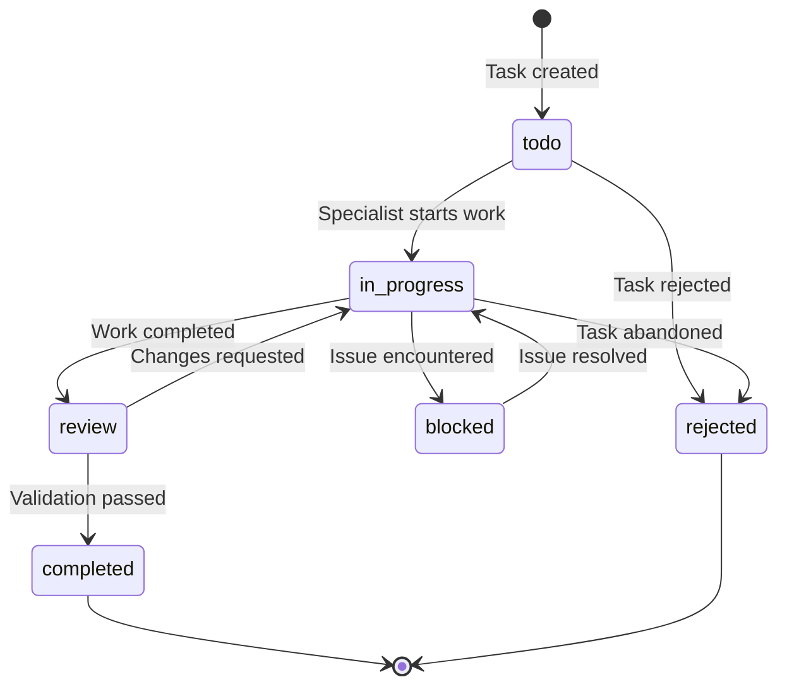

# /orchestrate - Smart Orchestration Command

## Purpose
Intelligent state detection and action command that adapts based on current project state.

## Product Owner Orchestration Logic

```mermaid
flowchart TD
    A["/orchestrate started"] --> B[Check All Task States]
    B --> C{review/ has tasks?}
    C -->|Yes| D["🔍 REVIEW completed work<br/>Validate quality & integration"]
    C -->|No| E{in_progress/ has tasks?}
    E -->|Yes| F["⏱️ MONITOR active work<br/>Check specialist progress"]
    E -->|No| G{todo/ has tasks?}
    G -->|Yes| H["📋 ASSIGN new work<br/>Spawn available specialists"]
    G -->|No| I{blocked/ has tasks?}
    I -->|Yes| J["🚫 RESOLVE blockers<br/>Update task guidance"]
    I -->|No| K{requirements/ has PRDs?}
    K -->|Yes| L["📝 CREATE tasks from PRD"]
    K -->|No| M["✅ ALL WORK COMPLETE<br/>Project finished"]
    
    D --> N{Review passed?}
    N -->|Yes| O["✅ Move to /completed/<br/>Update registry"]
    N -->|No| P["❌ ROLLBACK to /todo/<br/>Add guidance on what went wrong"]
    
    F --> Q{Specialist finished?}
    Q -->|Yes| R["📤 Task moved to /review/<br/>by specialist"]
    Q -->|No| S["⏳ Continue monitoring<br/>Wait for completion"]
    
    H --> T["👥 Specialists working<br/>Tasks in /in_progress/"]
    J --> U["🔧 Blockers resolved<br/>Move to /todo/"]
    L --> V["📋 New tasks in /todo/"]
    
    O --> B
    P --> B  
    R --> B
    S --> W[Wait for specialist updates]
    W --> B
    T --> B
    U --> B
    V --> B
    
    style A fill:#4ecdc4,color:#fff
    style D fill:#ffd700,color:#000
    style M fill:#90EE90,color:#000
    style P fill:#ff6b6b,color:#fff
```



**Product Owner Principles**:
- **Continuous Management**: Loop until all work complete
- **Active Monitoring**: Check specialist progress via JSON updates
- **Quality Control**: Review all completed work before accepting
- **Issue Resolution**: Rollback and reassign tasks that aren't done properly
- **Guidance Over Fixing**: Give specialists better directions, don't fix their work

## Task State Flow



## Auto-Delegation Map
**State Detection → Command Routing (Priority Order):**
1. **In-Progress Tasks exist** → `/orch-resume` (IMMEDIATE)
2. **Todo Tasks exist (no in-progress)** → `/orch-status` then `/orch-resume`
3. **PRD exists, No Tasks** → `/orch-tasks-create` 
4. **No PRD, No Tasks** → `/orch-prd-init`
5. **Force modes** → Direct command calls

## Orchestrator as Product Owner

### Core Management Loop
```
WHILE (tasks exist in any state) {
  1. REVIEW: Check /review/ for completed work → validate → approve/rollback
  2. MONITOR: Check /in_progress/ for specialist updates → detect completion
  3. ASSIGN: Check /todo/ for available work → spawn specialists
  4. RESOLVE: Check /blocked/ for issues → update guidance
  5. CREATE: Check PRDs for new task generation
  6. WAIT: Brief pause for specialist work updates
}
```

### Quality Control & Rollback Logic
**When specialist moves task to /review/:**
- Load task JSON + check acceptance criteria
- Validate work meets requirements
- Check codebase integration (tests pass, no conflicts)
- **If approved**: Move to /completed/, update registry
- **If rejected**: Move to /todo/, add specific guidance on issues found

### Specialist Monitoring
**Claude Code Native Detection:**
- Knows when sub-agents are spawned
- Detects when they finish working
- Monitors JSON file changes for status updates
- Can check git commits for progress indicators

### Task Assignment Strategy
**For /todo/ tasks:**
- Check specialist availability (not already working)
- Prioritize high-confidence, high-priority tasks
- Spawn specialist with full context: task JSON + last log + guidance
- Move task to /in_progress/ with assignment log

### Rollback & Reassignment
**When work needs improvement:**
- Move task back to /todo/ 
- Add detailed log entry: "What was attempted, what went wrong, what to do instead"
- Update acceptance criteria with more specific requirements
- Reassign to same or different specialist with better guidance

## Implementation Principles
1. **Continuous Management**: Loop until all work complete
2. **Quality Gates**: Review all work before accepting
3. **Smart Guidance**: Give better directions, don't fix work yourself
4. **Progress Monitoring**: Use JSON updates and Claude Code's native detection
5. **Parallel Safety**: Multiple specialists can work simultaneously