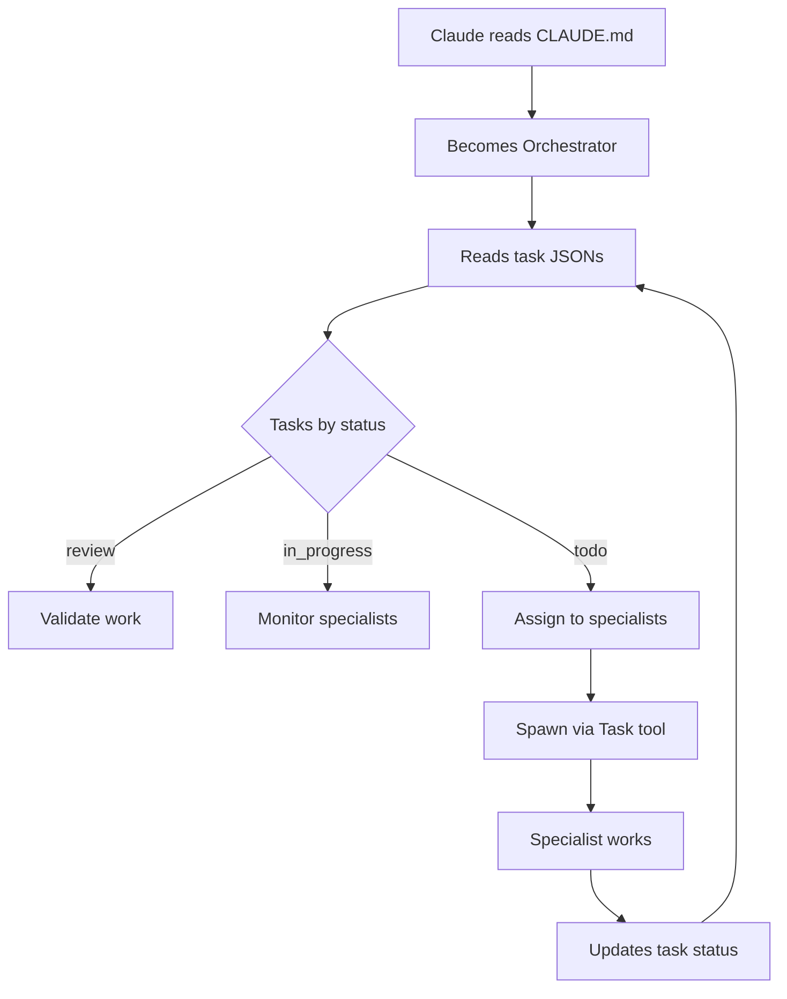

# CC Orchestrator Architecture

## How Framework Becomes Project

```
cc-orchestrator/                    your-project/
├── project-template/         →     ├── CLAUDE.md
│   ├── CLAUDE.md            →     ├── .claude/
│   ├── .claude/             →     │   └── commands/
│   ├── specialists/         →     ├── specialists/
│   └── tasks/               →     ├── tasks/
                                    └── [YOUR CODE]
```

## File Purposes in Deployed Project

### `/CLAUDE.md`
The main orchestrator - Claude Code reads this on startup and becomes the project orchestrator.

### `/.claude/commands/`
Custom commands available in your project:
- `/orchestrate` - Main orchestration loop
- `/status` - Check project status
- `/verify-tdd` - Verify test-driven development

### `/specialists/`
Role definitions for AI workers:
- `backend.md` - Backend development specialist
- `frontend.md` - Frontend/UI specialist
- `qa.md` - Testing specialist
- `documentation.md` - Documentation specialist

### `/tasks/`
JSON files tracking work:
```json
{
  "id": 1,
  "status": "todo",  // State management via this field
  "type": "backend",
  "title": "Create user API",
  ...
}
```

## Orchestration Flow



## Key Innovation: Status Field

Instead of moving files between directories:
```
OLD WAY:                          NEW WAY:
tasks/                            tasks/
├── todo/task-1.json              ├── task-1.json (status: "todo")
├── in_progress/task-1.json  →    ├── task-1.json (status: "in_progress")
├── review/task-1.json            ├── task-1.json (status: "review")
└── completed/task-1.json         └── task-1.json (status: "completed")
```

Benefits:
- Simpler file management
- Cleaner git history
- Easier state tracking
- No file movement needed