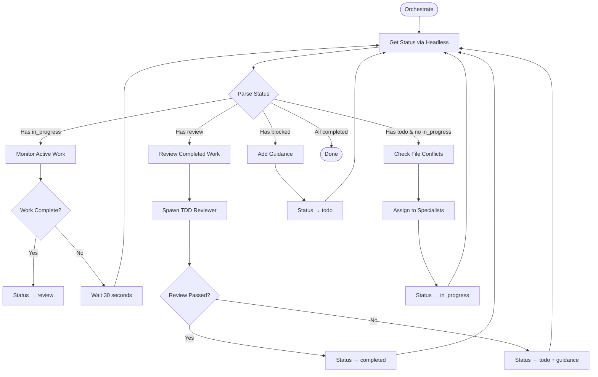

# /orchestrate



## Implementation

### 1. Get Current Status
```bash
# Use headless mode to get structured status
STATUS_JSON=$(cat .claude/commands/status.md | claude -p --output-format json)
```

### 2. Monitor In-Progress Tasks
Check if specialists have updated their tasks:
```bash
# Look for confidence_assessment in task JSONs
for task in $(echo "$STATUS_JSON" | jq -r '.in_progress[].id'); do
    if grep -q "confidence_assessment" ".cc-orchestrator/tasks/task-$task.json"; then
        # Specialist completed - update status to review
        jq '.status = "review"' ".cc-orchestrator/tasks/task-$task.json" > tmp && mv tmp ".cc-orchestrator/tasks/task-$task.json"
    fi
done
```

### 3. Review Work (Spawn TDD Reviewer)
```python
Task(
    description="Review task for TDD compliance",
    prompt="""You are a TDD review specialist. 
    
1. Check git history for task-{id}
2. Verify tests were written first and failed initially
3. Ensure tests weren't modified to pass
4. Return: {"verdict": "pass|fail", "reason": "..."}

Task to review: /.cc-orchestrator/tasks/task-{id}.json"""
)
```

### 4. Assign New Work (Only if No In-Progress)
```python
# Only assign if no active work
if in_progress_count == 0 and todo_tasks:
    # Check conflicts via headless
    conflicts = check_file_conflicts(todo_tasks)
    
    # Assign non-conflicting tasks
    for task in safe_tasks:
        Task(
            description=f"{task.type} task #{task.id}",
            prompt=f"""You are a {task.type} specialist.
            
Read: /.cc-orchestrator/specialists/{task.type}.md
Complete: /.cc-orchestrator/tasks/task-{task.id}.json
Update status to 'review' when done."""
        )
```

### 5. Continuous Loop
Keep orchestrating until all tasks are completed or interrupted.